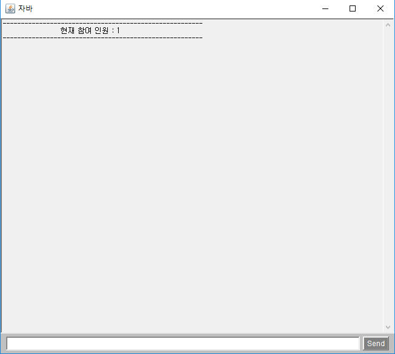
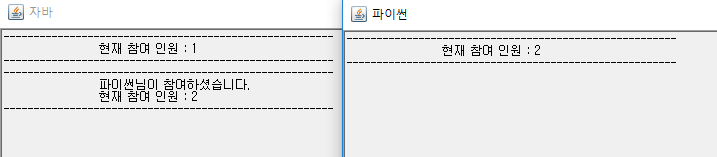
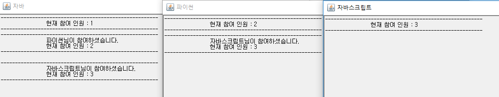
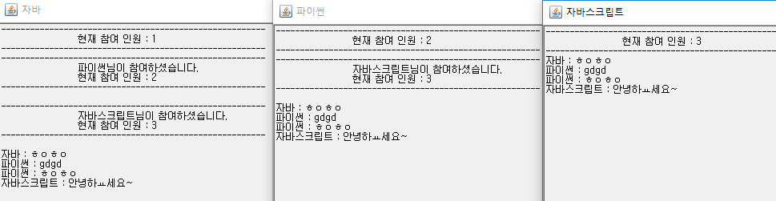
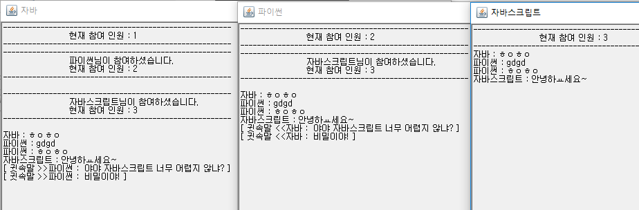
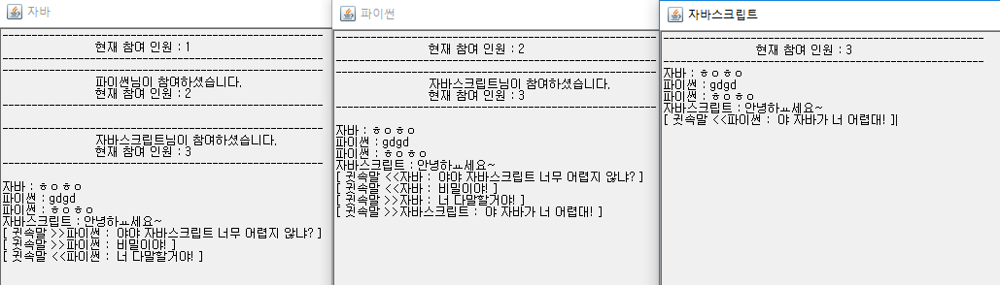
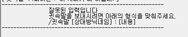
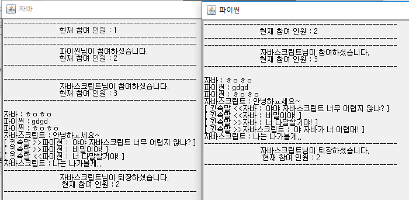
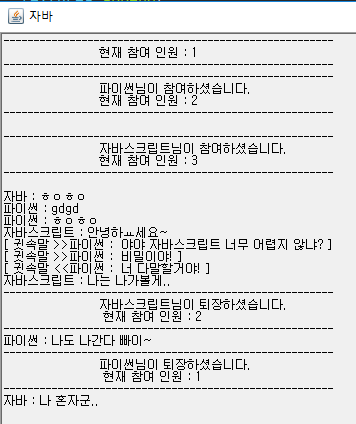

# Socket Chatting Program

```shell
D:\dowork\Eclipse-Workspace\chatcs\target\classes>java com.cafe24.network.chat.client.ChatClientApp
대화명을 입력하세요.
>>> 자바
```

> 

```shell
D:\dowork\Eclipse-Workspace\chatcs\target\classes>java com.cafe24.network.chat.client.ChatClientApp
대화명을 입력하세요.
>>> 파이썬
```

> 


```shell
D:\dowork\Eclipse-Workspace\chatcs\target\classes>java com.cafe24.network.chat.client.ChatClientApp
대화명을 입력하세요.
>>> 자바스크립트
```

> 

---

---





### 자바 -> 파이썬 귓속말 보내기

`/귓속말 파이썬 : 내용`

> 


> 


귓속말 없는 사용자의 경우 :

>

귓속말 사용자 형식 잘못 입력 : 

> 


---

퇴장






